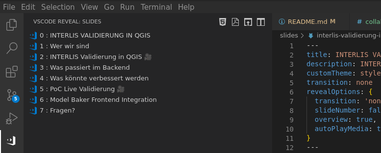

# INTERLIS VALIDIERUNG IN QGIS

Präsentation für den QGIS Anwender:innen Tag in Olten.

- Slides auf folgendem Link verfügbar: https://signedav.github.io/interlis-validierung-in-qgis/interlis-validierung-in-qgis.html#/ (erstellt bei push auf `main`)
- Mit `F11` maximieren Browserfenster maximieren.
- Mit Taste `s` Speaker Notes öffnen.
- Los geht's!

## Programm

- Slides: Intro
- Slides Um was gehts (Dave)
- Film: INTERLIS Validierung in QGIS (Dave)
- Slides: Was passiert im Backend mit ilivalidator (Oli)
- Slides: Was könnte verbessert werden? (Dave)
- Film: PoC Live Validierung (Oli)
- Slides: Model Baker Frontend Integration

## Work with VSCode
The easiest way is to install VSCode with the extension
[`vscode-reveal`](https://marketplace.visualstudio.com/items?itemName=evilz.vscode-reveal).

The `VSCode Reveal` plugin supports live-preview of the slides. Just click on the plugin on the left bar. Four toolbar buttons show up at the top. Click on `"Revealjs: Show presentation by side"` to instantly navigate through your presentation. Try out the other buttons for other preview modes and checkout the [docs](https://www.evilznet.com/vscode-reveal/#/README).

