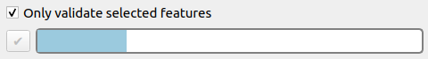
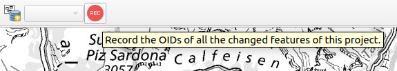
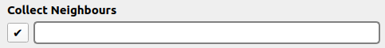

# INTERLIS VALIDIERUNG IN QGIS
### Möglichkeiten und Ideen

---

<!-- Oli's stage -->

## Wer wir sind

### Oliver Grimm @ [Geowerkstatt](https://www.geowerkstatt.ch/) 

### Dave Signer @ [OPENGIS.ch](https://www.opengis.ch/) 

<aside class="notes">
Wir arbeiten in Schweizer Softwarebuden, die sich beide den Open Source Lösungen im GIS Bereich verschrieben haben.
</aside>

---

## Um was geht's

<!-- Dave's stage -->

☑️ INTERLIS setzt **valide** Daten voraus

☑️ Daten können in QGIS **geflickt** werden

➡️ Integration vom **ilivalidator** im **Model Baker**

➡️ Von was man **träumen** kann

<aside class="notes">
Ein Hauptpfeiler des INTERLIS Ansatzes ist, dass die Daten <b>harmonisch</b> und <b>valide</b> sind.

In QGIS ist es möglich die Daten zu flicken.

<i>Doch es ist etwas mühsam anhand eines Log-Files die einzelnen Features / Koordinaten zu finden</i>

In dem letzten zwei Jahren wurde der ilivalidator quasi vollintegriert in QGIS Model Baker.
1. Die Daten müssen <b>nicht exportiert</b> werden, sondern werden direkt im QGIS validiert.
2. Die <b>interaktive</b> Ergebnissliste kann helfen die Features zu <b>finden und fixen</b>.
3. Dazu eine Demo gleich

Und danach noch einen kleinen Ausblick, von was man träumen könnte.
</aside>

---

<!-- Dave's stage -->

## INTERLIS Validierung in QGIS

<video controls="controls">
<source src="assets/validator.webm" type="video/mp4">
</video>

<aside class="notes">

<b>Video:</b>

- Datenbank -> Model Baker -> Daten Validator
- Die Datenquelle wird automatisch erkannt, auch wenn mehrere Datenquellen im QGIS Projekt sind.

- Lassen wir ihn mal durchlaufen -> finden 12 Fehler: Geometrieüberschneidungen, falsch formatierte TID, Werte ausserhalb des Bereiches
- Navigieren wir durch die Fehler. Aktivieren wir das Aufläuchten und zentrieren (wie in Attributtabelle)
- Tatsächlich sind es nicht so viele Fehler in diesem Beispiel, dennoch schränken wir die Validierung noch etwas ein.
  - Wählen wir nur den Basket für das Topic "Nature" anhand des Behälters
  - Nun sind es noch 4 Fehler. Wollen wir uns um die Geometriefehler später kümmern, deaktivieren wir die Geometriechecks
  - Noch ein Fehler
- Wollen wir diesen fixen, wir öffnen das Formular 
  - sehen dass es die t_ili_tid nicht gibt (wir könnten nun die Formularkonfiguration dieses Layers anpassen, machen wir aber nicht) 
  - wir öffnen die Attributtabelle, gehen auf den Feldkalkulator und updaten das ensprechende Feld mit der Korrekten UUID
- Schauen wir uns noch den Geometriefehler an, wir validieren nochmals und berücksichtigen Geometriechecks.
  - Wir können auf die fehlerhaften Koordinaten zoomen und mit dem Stützpunkwerkzeug und der Hilfe des Snapping Tools, dies Fixen. Stützpunkteditor ist ebenfalls cool.
- Wir können auch einzelne Constraints mit einem Konfigurationsfile ausschalten. 
- Dazu validieren wir das andere Topic. 
- Dann haben wir dieses File, haben von einzelnen Klassen und Attribute die constraints ausgeschaltet.
- Wir lassen es durchlaufen - haben noch den einen Fehler. 
- Dieser ist bereits benannt, dennoch können wir noch ein spezifischere Message hinzufügen.
</aside>

---

<!-- Oli's stage -->

## Was passiert im Backend?

☑️ Datenbank: PostGIS, Geopackage / ili2db erstellt physisches Schema

☑️ ilivalidator erkennt daraus alle Modell-Merkmale

☑️ Konfig. Möglichkeit für Verschärfungen/Abschwächungen

☑️ Full-Set vs. Baskets - Validierung

☑️ First pass -> Second pass

➡️ Valid y/n und Protokollfiles

<aside class="notes">
Am Backend überprüft der ilivalidator den Datensatz. Die QGIS-Daten liegen in einer Datenbank vor (PostGIS oder Geopackage) wobei das physische Schema durch ili2db erstellt wurde. Dadurch kennt sich der ilivalidator darin aus. 
- Der ilivalidator erkennt alle Merkmale des Modells wie Klassen, Attribute und Beziehungen zwischen den Klassen. Dadurch kann er die Daten gegen die INTERLIS-Regeln prüfen.
- Die Prüfung geschieht typischerweise in 2 "runs": In Run#1 passiert die Prüfung Datensatz-für-Datensatz / in Run#2 prüft der ilivalidator dann Datensätze gegeneinander (zB. für Topologiechecks oder Objektbzeiehungen)
- Eine Prüfung kann über die vollständige Datenbank passieren oder als Option, nur auf sogenannte Baskets (bzw. Datasets)
- Der ilivalidator ermöglicht auch, dass gewisse Prüfungen weggelassen oder verschärfte Regeln berücksichtigt werden.
- Vorallem Prüfungen im Run#2 sind teilweise sehr aufwändig und benötigen entsprechend Rechenzeit und Ressourcen. Daher kann eine Validierung schnell viel Zeit in Anspruch nehmen.
- Die Resultate stellen drei Outputs dar: 1. Validierung erfolgreich Ja/nein  2. Protokoll-Datei mit allen Warnungen und Fehlern  3. GIS-fähige Protokolldatei mit verorteten Fehlern
  
</aside>

---

<!-- Dave's stage -->

## Ideen

  - Mächtigere **QGIS Tools**
  - **Vollintegration** der Constraints
  - Validierung **stufenweise** ansteuern
  - Live (**Subset**) Validierung 

<aside class="notes">
Es gibt einige Ideen, wie man das nun <b>noch besser</b> machen könnte.

QGIS Tools: ZBs. der Topologiechecker - ersetzt aber INTERLIS Check nicht.

Constraints: herauslesen aus INTERLIS Compiler.

Speed up mit ili2db `--singlePassValidation`. 

Problem, dass grosse Datensätze immer ganz validiert werden müssen. Es gibt die Möglichkeit von Behälter etc. aber die Daten können nicht immer einfach separiert werden. 

Deshalb die Idee der Subset validierung.

</aside>

---

## PoC Live Validierung

<!-- Oli's stage -->
  
- Validierung direkt bei der Speicherung
- Bildung des Subsets aus dem editierten Objekt und allen topologischen Nachbarn
- Validierung des Subsets
  
<aside class="notes">
  
- Prinzipiell ein funktionierendes Konzept: Zeitbedarf kann extrem reduziert werden > Ansatz in Produktionsumgebungen für aktuell validierten Datenbestand
- Validierung der Attribut-Eigenschaften, Datentypen und MANDATORY und EXISTENCE CONSTRAINTS
- Einschränkung des POC: 
  - Keine Validierung der Objektreferenzen (da nicht sichergestellt werden kann, ob sie im Datenbestand oder nur im Subset fehlen (weil sie keine Nachbarn sind)
  - Umgang mit Datensätzen aus nicht-geometrischen Klassen
  - Umgang mit Constraints wie SET, PLAUSIBILIY CONSTRAINTS
- Erweiterung des ilivalidators mit einem sog. Subset-Parameter (Array von Objekt-Identifikatoren (OID) o.ä.)   

</aside>

---

## PoC Live Validierung 🎥

<!-- Oli's stage -->
  
<video controls="controls">
<source src="assets/poc.webm" type="video/mp4">
</video>

---

## PoC Live Validierung

<!-- Oli's stage -->
 
Erkenntnisse:
  
➡️ Prinzipiell funktionierendes Konzept

➡️ Einschränkungen (Objektrefs, SET CONSTRAINTS, Objekte ohne Geometrie)

➡️ Erweiterung des ilivalidators ist möglich

---

## Model Baker Frontend
 

#### Übergeben einer Selektion

#### Aufzeichnung einer Session

<aside class="notes">
Es gibt mehrere Ansätze, wie dies in Model Baker integriert werden könnte. Sie <b>schliessen sich nicht aus</b>.

<b>Übergeben der OIDs aller selektierten Features. Auch möglich "Selektierte Features des aktuellen Layers"</b>

<b>Pros</b>
- Straightforeward und leicht verständliche Lösung.
- Kann auch als Validierung des Layers (wenn alles selektiert ist) benutzt werden.

<b>Cons</b>
- Man muss den Überblick über alle Selektionen behalten. Man muss evtl. durch alle Layer gehen und die Selektion überprüfen. Vielleicht wär auch noch eine Option "Deselect all on all layers" hilfreich.
- Auch erfasst man vielleicht Features auf Kind-Layer, die dann mühsam zu finden sind für die Selektion. Ein automatisches Ermitteln und Hinzufügen von referenzierten Features aber kann zu Loops und grossen Datenmengen führen, weshalb darauf verzichtet wird.

<b>Aufzeichnung aller Features, die geändert wurden (ihre OIDs) - könnte auch automatisch starten.</b>

<b>Pros</b>
- Es braucht keine manuelle Selektion.
- Man behält die OIDs der geänderten Features über mehrere "Speicherungen".

<b>Cons</b>
- Komplexität / Verständlichkeit / Neue Komponente (Maintanance etc.)

</aside>

---

## Model Baker Zusatzfunktion

#### Ermitteln der Nachbarn

<aside class="notes">
Sofern die Features Geometrien haben, sollen auch die OIDs der Nachbars-Features ermittelt und übergeben werden.

Je nach Menge muss auf die Performance geachtet werden. Evtl. braucht es einen zusätzlichen Panel: "Collect neighbours" -> wenn man sieht es geht viel zu lange, soll man auch abbrechen können.
</aside>

---

## Fragen?
 

#### Web: www.geowerkstatt.ch / www.opengis.ch
#### Emails: oliver.grimm@geowerkstatt.ch / david@opengis.ch 
#### Social: @GrimmOliver / @signedav@fosstodon.org
